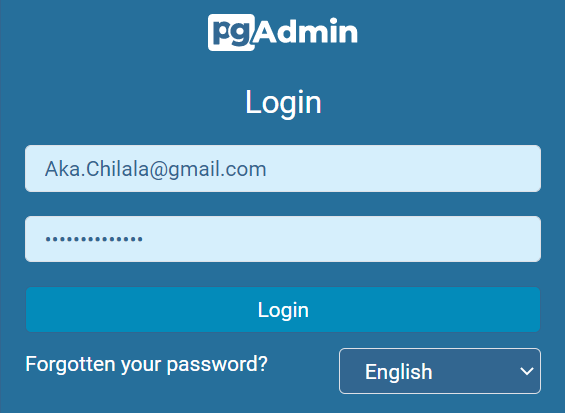
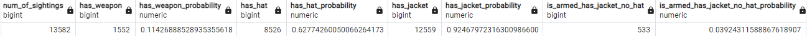

# Getting started
Much of this project is containerized, shouldn't require much to get up and running, other than for the following dependencies:

> 1. _git_
> 2. _Docker_
> 2. _Bash or WSL_

## Clone Project from Repos
Find my forked version of the project in my repos:
```ps
git clone https://github.com/achilala/theres-carmen-postgres.git

cd theres-carmen-postgres
```

## How-to Setup the Environment
In the root folder, if none already exists, create an environment file with the following variables and values:
```sh
DBT_ENVIRONMENT=PROD
DBT_SERVER=interpol_dwh
DBT_DATABASE=interpol_db
DBT_PORT=5432
DBT_SCHEMA=
DBT_USERNAME=interpol_user
DBT_PASSWORD=i<30p3n50urc3
DBT_THREADS=10
POSTGRES_USER=${DBT_USERNAME}
POSTGRES_PASSWORD=${DBT_PASSWORD}
POSTGRES_DB=${DBT_DATABASE}
PGADMIN_DEFAULT_EMAIL=Aka.Chilala@gmail.com
PGADMIN_DEFAULT_PASSWORD=${DBT_PASSWORD}
```

## How-to Start-up the Environment
To bring up the docker containers and generate dbt seed files:
```ps
docker-compose up --detach
```
Once the Python container is up and running it will execute the python code and generate the `seed` files about 5 secs after.

Execute the `setup_dbt.sh` file to configure a dbt `alias` of the `docker run` command:
```ps
./setup_dbt.sh
```

## How-to run dbt
To build the dbt models and generate the dbt catalogue `execute` this batch file:
```ps
./build_dbt.sh
```

or invoke the commands from the `bash` cli:

```ps
source ~/.bash_aliases

dbt clean
dbt deps
dbt build
dbt docs generate
dbt docs serve
```

## Where-to Find the generate dbt Docs
locally
> [http://localhost:8080](http://localhost:8080)

or hosted on Netlify
> [Theres Carmen dbt Docs](https://theres-carmen-dbt-docs.netlify.app)


## How-to Explore the built Schemas and Data
Chose PostgreSQL (since that's what you use) as the database of choice, and included PGAdmin for a better UX exploring the models
> [http://localhost:80](http://localhost:80)

Login
```
Email Address / Username: Aka.Chilala@gmail.com
Password: i<30p3n50urc3
```


Register the server as follows:

General
```
Name: interpol_dwh
```


Connection
```
Host name/address: interpol_dwh
Username: interpol_user
Password: i<30p3n50urc3
```


There's a `.env` config file in the root folder of this project that contains all the project environment variables

## ERD
This is the ER diagram of the Kimbal dimensional model


## Analytics

* A bit of house keeping
     - There was nothing much in the way of business keys in the dataset other than the lat long coordinates and the country code
     - No way of telling whether or not a witness/agent by the same name was the same person. My assumption is that witness name plus city is the same witness and agent name plus HQ is the same agent

* Answers the following questions:

    a. For each month, which agency region is Carmen Sandiego most likely to be found?
    
    

    b. Also for each month, what is the probability that Ms. Sandiego is armed __AND__ wearing a jacket, but __NOT__ a hat?
    
    

         What general observations about Ms. Sandiego can you make from this?

         Not much to see here to be honest, other than that this combination of general observations hadly occurs. Ms. Sandiego is hadly armed and is spotted wearing a hat more than half the time.

    

    c. What are the three most occuring behaviors of Ms. Sandiego?

    

    d. For each month, what is the probability Ms. Sandiego exhibits one of her three most occurring behaviors?
    
    